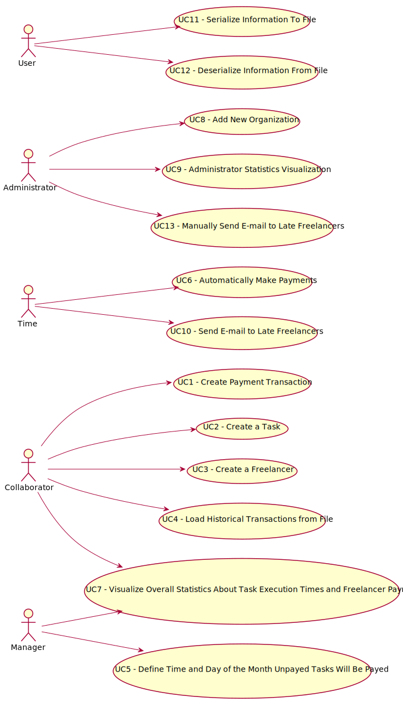

# Use Case Diagram

# Use Cases

| UC   | Description |
|------|-------------|
| UC1  | [Create Payment Transaction](../UC_01/UC_01.md) |
| UC2  | [Create a Task](../UC_02/UC_02.md) |
| UC3  | [Create a Freelancer](../UC_03/UC_03.md) |
| UC4  | [Load Historical Transactions from File](../UC_04/UC_04.md) |
| UC5  | [Define Time and Day of the Month Unpaid Tasks Will Be Paid](../5/UC_05.md)
| UC6  | [Automatically Make Payments](../UC_06/UC_06.md) |
| UC7  | [Visualize Overall Statistics About Task Execution Times](../UC_07/UC_07.md) |
| UC8  | [Add New Organization](../UC_08/UC_08.md) |
| UC9  | [Administrator Statistics Visualization](../UC_09/UC_09.md) |
| UC10 | [Send E-mail to Late Freelancers](../UC_10/UC_10.md) |
| UC11 | [Serialize Information To File](../UC_11/UC_11.md) |
| UC12 | [Deserialize Information From File](../UC_12/UC_12.md) |
| UC13 | [Manually Send E-mail to Late Freelancers](../UC_13/UC_13.md) |