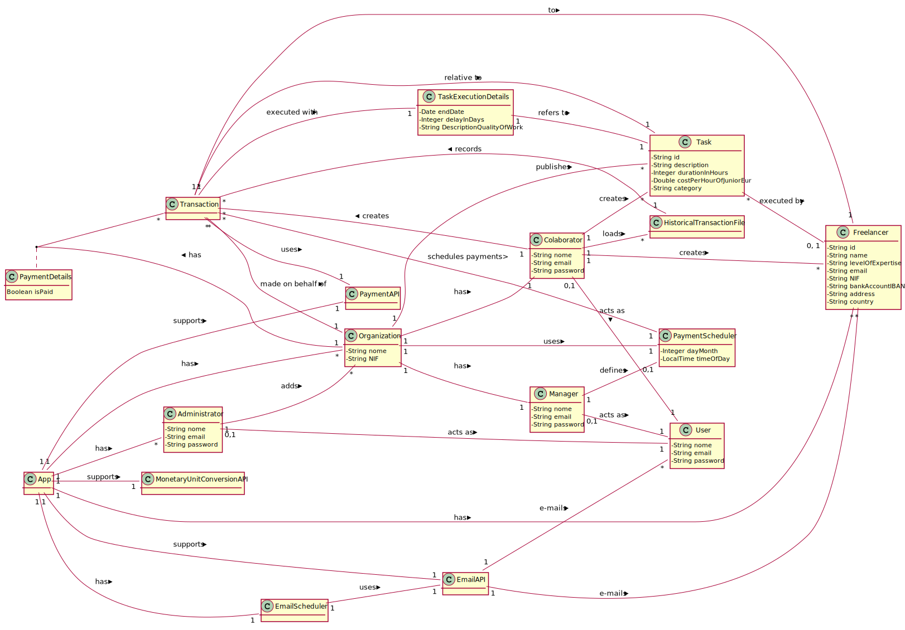

# OO Analysis

## Rational for the identification of domain classes

### Category List

**Transactions (of business)**
**Lines of Transaction**

- Transaction

**Products or services related to transactions**

- Task

**Registers (of transactions)**

- Payment

**Roles of people**

- Colaborator (Organization)
- Manager (Organization)
- Administrator (T4J)
- Freelancer

**Places**

- App

**Events**

- PaymentScheduler
- EmailScheduler

**Physical objects**
**Specifications or descriptions**

- TaskExecutionDetails

**Catalogs**
**Groups**
**Elemnts of groups**
**Organization**

- Organization
- T4J

**Other systems (external)**

- MonetaryUnitConversionAPI
- EmailAPI
- PaymentAPI

**Regists (financial), of jobs, contacts, legal documents**
**Financial instruments**
**Referenced documents**

- HistoricalTransactionFile

## **Rational about the identification of associations between classes**

|Concept (A)               |Association            |Concept (B)               |
|-------------------------:|:---------------------:|:-------------------------|
|Colaborator               |creates                |Transaction               |
|                          |creates                |Task                      |
|                          |creates                |Freelancer                |
|                          |loads                  |HistoricalTransactionFile |
|                          |acts as                |User                      |
|Manager                   |defines                |PaymentScheduler          |
|                          |acts as                |User                      |
|Payment                   |registers              |Transaction               |
|                          |uses                   |EmailAPI                  |
|                          |uses                   |PaymentAPI                |
|                          |uses                   |MonetaryUnitConversionAPI |
|Transaction               |relative to            |Task                      |
|                          |executed with          |TaskExecutionDetails      |
|                          |to                     |Freelancer                |
|TaskExecutionDetails      |refer to               |Task                      |
|HistoricalTransactionFile |records                |Transaction               |
|PaymentScheduler          |makes automatically    |Payment                   |
|Organization              |has                    |Colaborator               |
|                          |has                    |Manager                   |
|                          |uses                   |PaymentScheduler          |
|                          |responsible by         |Payment                   |
|                          |publishes              |Task                      |
|                          |has unpaid             |Transaction               |
|Task                      |executed by            |Freelancer                |
|App                       |supports               |MonetaryUnitConversionAPI |
|                          |has                    |Organization              |
|                          |supports               |EmailAPI                  |
|                          |supports               |PaymentAPI                |
|                          |supports               |PasswordAPI               |
|                          |registers              |Payment                   |
|                          |has                    |Administrator             |
|                          |has                    |EmailScheduler            |
|                          |has                    |Freelancer                |
|EmailScheduler            |uses                   |EmailAPI                  |
|Administrator             |adds                   |Organization              |
|                          |acts as                |User                      |
|Freelancer                |acts as                |User                      |
|EmailAPI                  |e-mails                |User                      |
|                          |e-mails                |Freelancer                |

## Domain model

