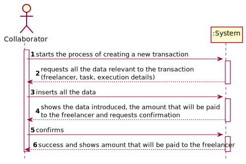

# UC1 - Create Payment Transaction

## 1. Requirements Engineering

### Brief Format
The collaborator starts the process of creating a new transaction. The system requests all the data relevant to the transaction (freelancer, task, execution details). The collaborator inserts all the data. The systems shows the data introduced, the amount that will be payed to the freelancer and requests confirmation. The collaborator confirms. The system validates and stores the data and informs the collaborator of the success of the operation.

### SSD

### Complete Format

#### Main Actor

- Collaborator.

#### Interested Parties and Their Interests
* **Freelancer:** intends to be able to get paid by the organizations for the tasks that they executed.
* **Collaborator:** intends to add a new transaction to the system so that payments can be made to them.
* **Organization:** intends to have all the data relevant to make payments to the freelancers who complete their tasks.
* **T4J:** intends to satisfy the interests of the parties mentioned above.

#### Pre-Conditions
\-

#### Pos-Conditions
The task is marked as as being executed and will be payed automatically on the date specified by the manager.

#### Main Scenario of Success (or Basic flow)

1. The collaborator starts the process of creating a new transaction.
2. The system shows all the unexecuted tasks published by their organization.
3. The collaborator chooses one.
4. The system shows all the freelancers in the system.
5. The collaborator chooses one freelancer. (the one that executed the task)
6. The system requests all the relevant information about the execution of the task (end date, days of delay, description of the quality of the work)
7. The collaborator introduces all the data.
8. The systems shows the data introduced, the amount that will be payed to the freelancer and requests confirmation.
9. The collaborator confirms.
10. The system validates and stores the data and informs the collaborator of the success of the operation.

#### Extensions (or Alternative Flows)

\*a. The user cancels the creation of the freelancer.

> The UC ends.

2a. There are no unexecuted tasks on the system/ the task has not been added to the system.

> 1.The system allows the collaborator to add a new task (UC2) or cancel the operation.
> > 1a. The collaborator chooses to add a new task.
> > > 1. The system starts UC2
> > > 2. The system resumes UC1 from step 2.
> >
> > 1b. The user cancels the operation
> > > The UC ends.

4a. There are no freelancers on the system/ the freelancer has not been added to the system.

> 1.The system allows the collaborator to add a new freelancer (UC3) or cancel the operation.
> > 1a. The collaborator chooses to add a new freelancer.
> > > 1. The system starts UC3
> > > 2. The system resumes UC1 from step 4.
> >
> > 1b. The user cancels the operation
> > > The UC ends.

7a. Not all the necessary data was introduced.

> The system informs the user and allows them to reintroduce the data beginning at step 2.

10a. The system detects invalid data

> 1. The system inform the user of the error.
> 2. The UC ends.

#### Special Requirements
\-

#### List of Variations in Technology or Data

\-

#### Frequency of Occurrence

\-

#### Open Questions

- What's the frequency of this UC?

## 2. OO Analysis

### Excerpt from the Relevant Domain Model for UC

## 3. Design - Use Case Realization

### Rational

|Main Flow                                                                                                                                                      |Question: What Class ...                               |Answer                         |Justification|
|---                                                                                                                                                            |---                                                    |---                            |---|
|1. The collaborator starts the process of creating a new transaction.                                                                                          |… interacts with the user?                             |CreateTransactionUI            |Pure Fabrication.|
|                                                                                                                                                               |… coordinates the UC?                                  |CreateTransactionController    |Controller.|
|2. The system shows all the unexecuted tasks published by their organization.                                                                                  |... knows the tasks published by the organization?     |ListTask                       |By the Information Expert (IE) principle Organization contains Task, however by the High Cohesion & Low Coupling (HC+LC) principle, that responsibility has been assigned to ListTask.|
|                                                                                                                                                               |... knows if a task has been executed?                 |Task                           |Knows the information contained in itself.|
|3. The collaborator chooses one.                                                                                                                               |                                                       |                               ||
|4. The system shows all the freelancers in the system.                                                                                                         |... Knows the freelancers in the system?               |RegistFreelancer               |By the IE principle App contains Freelancer, however by the HC+LC principle, that responsibility has been assigned to RegistFreelancer.|
|5. The collaborator chooses one freelancer. (the one that executed the task)                                                                                   |                                                       |                               ||
|6. The system requests all the relevant information about the execution of the task (end date, days of delay, description of the quality of the work)          |                                                       |                               ||
|7. The collaborator introduces all the data.                                                                                                                   |... stores the data introduced?                        |Transaction                    |The information is part of Transaction|
|                                                                                                                                                               |... creates instances of Transaction?                  |ListTransaction                |Creator (Rule 1)|
|8. The systems shows the data introduced, the amount that will be payed to the freelancer and requests confirmation.                                           |... knows the value to be paid?                        |Transaction                    |Transaction has all the necessary data to calculate that value.|
|9. The collaborator confirms.                                                                                                                                  |                                                       |                               ||
|10. The system validates and stores the data and informs the collaborator of the success of the operation.                                                     |... stores instances of Transaction?                   |ListTransaction                |By the IE principle Organization contains Transaction, however by the HC+LC principle, that responsibility has been assigned to ListTransaction.|

### Systematization

It follows from the rational that the conceptual classes promoted to software classes are:

 * Task
 * Transaction

Other software classes (i.e. Pure Fabrication) identified:

 * CreateTransactionUI
 * CreateTransactionController
 * ListTask
 * RegistFreelancer
 * ListTransaction

### Sequence Diagram

#### UC1_Detail_getUnexecutedTaks

### Class Diagram

