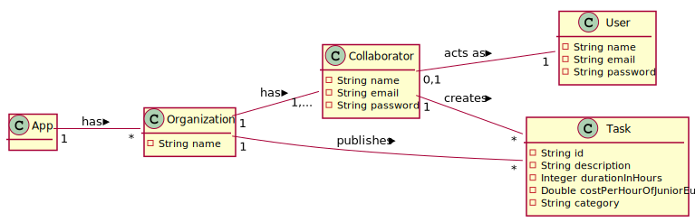
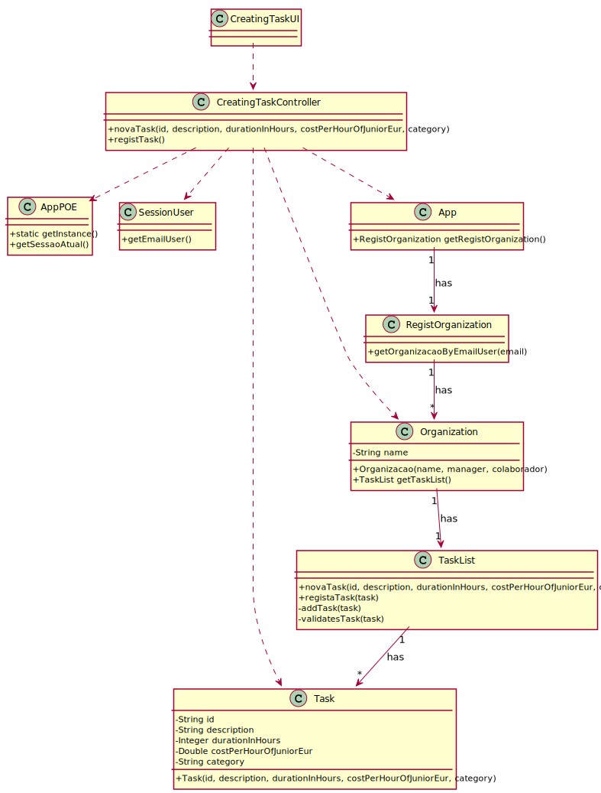

# UC02 - Create a Task

## 1. Requirements Engineering

### Brief Format

The collaborator stars the creating of a new task. The system request the task data (i.e. id, description, durationInHours, costPerHourOfJuniorEur, category). The collaborator enter the requested data. The system validates and presents the data, asking to confirm. The collaborator confirms. The system **adds the new task information**  and informs the collaborator of the success of the operation.

### SSD

### Complete format

#### Main actor

Collaborator

#### Interested Parties and Their Interests
* **Collaborator:** pretends to add new tasks so that it can take advantage of the functionality provided by the app.
* **Organization:** pretends that employees to be able to specify tasks for later publication.
* **T4J:** pretends that new tasks can be added in order to use the app.

#### Pre-Conditions
\-

#### Pos-Conditions
The registration information is saved in the system.

#### Main success scenario (or basic flow)

1. The collaborator stars the crating of a new task.
2. The system request the task data (i.e. id, description, durationInHours, costPerHourOfJuniorEur, category).
3. The collaborator enter the requested data.
4. The system validates and presents the data, asking to confirm.
5. The collaborator confirms.
6. The system **adds the new task information**  and informs the collaborator of the success of the operation.

#### Extensions (or alternative flows)

*a. the collaborator requests to cancel the registration.

> Use case ends.

4a. Missing minimum required data.
>	1. The system informs you which data is missing.
>	2. The system allows you to enter the missing data (step 3)
>
	>	2a. the collaborator does not change the data. The use case ends.

4b. The system detects that the data (or some subset of the data) entered must be unique and that it already exists in the system.
>	1. The system alerts the collaborator to the fact.
>	2. The system allows you to change it (step 3)
>
	>	2a. the collaborator does not change the data. The use case ends.

#### Special requirements
\-

#### List of Technologies and Data Variations
\-

#### Frequency of Occurrence
\-

#### Open questions

* Are there other data that are needed?
* Is all data mandatory?
* When the desired category does not exist, is it necessary to collect any information or notify someone that this has happened?
* The list of categories can be extensive. Does it make sense to allow filters (e.g. by activity area) and / or search (e.g. by description)?
* How often does this use case occur?

## 2. OO Analysis

### Excerpt from the Relevant Domain Model for UC

## 3. Design - Use Case Realization

### Rational

| Main Flow | Question: What Class... | Answer  | Justification  |
|:--------------  |:---------------------- |:----------|:---------------------------- |
|1. the collaborator stars the crating of a new task..|... interact with the user?| CreatingTaskUI |Pure Fabrication|
| |... coordinate the UC?| CreatingTaskController |Controller|
| | ... creates a Task instance? | TaskList | Creator (Rule1) + HC / LC: in MD the Organization has a Task. By HC / LC delegates these responsibilities in TaskList. |
|| ... knows the user / collaborator using the system? | SessaoUtilizador | IE: cf. user management component documentation.
|| ... knows which organization the user / collaborator belongs to? | RegistOraganization | IE: knows all organizations. |
||| Organization | IE: knows employees. |
||| Collaborator | IE: knows data (e.g. email). |
|2. the system request the task data (i.e. id, description, durationInHours, costPerHourOfJuniorEur, category).||||
|3. The collaborator enters the requested data. | ... keep the data entered? | Task | Information Expert (IE) -instance created in step 1: it has its own data. |
|4. The system validates and presents the data to the collaborator, asking him to confirm it. | ... validates the Task data (local validation)? | Task | IE: has its own data.
| | ... validates the Task data (global validation)? | TaskList | IE: the TaskList contains / aggregates Task. |
|5. the collaborator confirms. ||||
|6. The system records the data and informs the collaborator of the success of the operation. | ... keep the created Task? | TaskList | IE: the TaskList contains / aggregates Task. |

### Systematization ##

 It follows from the rational that the conceptual classes promoted to software classes are:

 * App
 * Organization
 * Collaborator
 * Task

Other software classes (i.e. Pure Fabrication) identified:

 * CreatingTaskUI
 * CreatingTaskController
 * TaskList
 * ResgistOrganization

###	Sequence Diagram

###	Class Diagram

