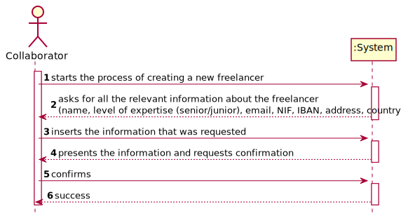
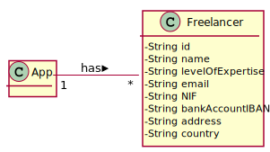
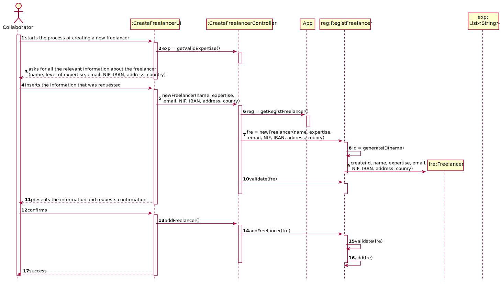

# UC3 - Create Freelancer

## 1. Requirements Engineering

### Brief Format
The collaborator starts the process of creating a new freelancer. The system asks for all the relevant information about the freelancer. The collaborator inserts the information that was requested. The system presents the information and requests confirmation. The collaborator confirms. The systems validates the data, stores it and informs the user of the success of the operation.

### SSD

### Complete Format

#### Main Actor

- Collaborator.

#### Interested Parties and Their Interests
* **Freelancer:** intends to be able to get paid by the organizations who use the app.
* **Collaborator:** intends to add a new *freelancer* to the system so that payments can be made to them.
* **Organization:** intends to have all the data relevant to make payments to the freelancers who complete their tasks.
* **T4J:** intends to satisfy the interests of the parties mentioned above.

#### Pre-Conditions
\-

#### Pos-conditions
A new *freelancer* is available in the system.

#### Main Scenario of Success (or Basic Flux)

1. The **Collaborator** starts the process of creating a new **Freelancer**.
2. The *system* asks for all the relevant information of the **Freelancer** (name, level of expertise (senior/junior), email, NIF, IBAN, address, country).
3. The collaborator inserts the information that was requested.
4. The system validates and presents the information and requests confirmation.
5. The collaborator confirms.
6. The systems validates the data that was introduced, stores it and informs the user of the success of the operation.

#### Extensions (or Alternative Fluxes)

\*a. The user cancels the creation of the freelancer.

> The UC ends.

4a. The system detects that either the email, NIF or IBAN are not unique.

> The system informs the user and allows them to reintroduce the data beginning at step 2.

4b. Not all the necessary data was introduced.

> The system informs the user and allows them to reintroduce the data beginning at step 2.

#### Special Requirements
\-

#### List of Variations in Technology or Data

\-

#### Frequency of Occurrence

\-

#### Open Questions

- What's the frequency of this UC?
- Is there any validation needed for the address of the *freelancer*?
- Is there any validation needed for the country of the *freelancer*?

## 2. OO Analysis

### Excerpt from the Relevant Domain Model for UC

## 3. Design - Use Case Realization

### Rational

| Main Flow                                                                                                                                                     | Question: What Class ...                                      | Answer                        | Justification               |
|:--------------                                                                                                                                                |:----------------------                                        |:----------                    |:----------------------------|
| 1. The **Collaborator** starts the process of creating a new **Freelancer**.                                                                                  | …interacts with the user?                                     | CreateFreelancerUI            |Pure Fabrication. |
|                                                                                                                                                               | …coordinates the UC?                                          | CreateFreelancerController    |Controller. |
|                                                                                                                                                               | …creates instances of Freelancer?                             | RegistFreelancer              |By the IE principle App contains Freelancer, however by the High Cohesion & Low Coupling (HC+LC) principle, that responsibility has been assigned to RegistFreelancer. |
| 2. The *system* asks for all the relevant information of the **Freelancer** (name, level of expertise (senior/junior), email, NIF, IBAN, address, country).   |                                                               |                               | |
| 3. The collaborator inserts the information that was requested.                                                                                               | …saves the information that was inserted?                     | Freelancer                    | Instance created in step 1. |
| 4. The system validates and presents the information and requests confirmation.                                                                               | …validates the data in Freelancer (local validation)          | Freelancer                    | IE: Contains its own data. |
|                                                                                                                                                               | …validates the data in Freelancer (global validation)         | RegistFreelancer              | By the IE principle App contains Freelancer, however by the HC+LC principle, that responsibility has been assigned to RegistFreelancer. |
| 5. The collaborator confirms.                                                                                                                                 |                                                               |                               | |
| 6. The systems validates the data that was introduced, stores it and informs the user of the success of the operation.                                        | …saves the organization created?                              | RegistFreelancer              | By the IE principle App contains Freelancer, however by the HC+LC principle, that responsibility has been assigned to RegistFreelancer. |

### Systematization

It follows from the rational that the conceptual classes promoted to software classes are:

 * Freelancer

Other software classes (i.e. Pure Fabrication) identified:

 * CreateFreelancerUI
 * CreateFreelancerController
 * RegistFreelancer

### Sequence Diagram

### Class Diagram

