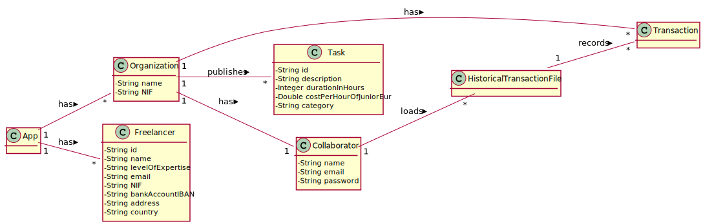

# UC4 - Load Historical Transactions from File

## 1. Requirements Engineering

### Brief Format

The collaborator starts the process of load historical transactions from file. The system asks witch file should be loaded. The collaborator selctes the file. The system tries to open the file and displays the data contained in the file. The collaborator confirms the data. The system validates and saves file data and informs collaborator of the successful operation.

### SSD

### Complete Format

#### Main Actor

- Collaborator.

#### Interested Parties and Their Interests
* **Collaborator:** pretends to be able to load historical transactions from file to the system.
* **T4J:** pretends to allow the app to load files.

#### Pre-Conditions
\-

#### Pos-conditions
\-

#### Main Scenario of Success (or Basic Flux)

1. The collaborator starts the process of load historical transactions from file.
2. The system asks witch file should be loaded.
3. The collaborator selctes the file.
4. The system tries to open the file and displays the data contained in the file.
5. The collaborator confirms the data.
6. The system validates and saves file data informs collaborator of the successful operation.

#### Extensions (or Alternative Fluxes)

*a. The collaborator requests the cancellation of the process.

> The use case ends.

4a. An error occurs while trying to open the file.

> 1. The system informs the collaborator of the error.
> 2. The use case ends.

6a. the system detects duplicate data in the file

> 1. The system informs the collaborator that an error occurred while reading a certain line.

#### Special Requirements
\-

#### List of Variations in Technology or Data
\-

#### Frequency of Occurrence
\-

#### Open Questions

- What is the frequency of occurrence of this UC?

## 2. OO Analysis

### Excerpt from the Relevant Domain Model for UC

## 3. Design - Use Case Realization

### Rational
|Main Flow  |Question: What Class ... |Answer|Justification|
|:---------|:---------|:---------|:---------|
|1. The collaborator starts the process of load historical transactions from file                           | ... interacts with the user?                                    | LoaderUI           | PureFabrication.                                                      |
|                                                                                     | ... coordinates the use case?                                   | LoaderController   | Controller.                                                           |
|2. The system asks witch file should be loaded. |                                                                 |                       |                                                                       |
|3. The collaborator selctes the file.                                                                |                                                                 |                       |                                                                       |
|4. The system tries to open the file and displays the data contained in the file.                     | ... creates new instance of HistoricalTransactionFile      | HistoricalTransactionFile                   | Information Expert: On the MD HistoricalTransactionFile knows how to save data in the system.   |
|5. The collaborator confirms the data.                                                            |                                                                 |                       |                                                                       |
| 6. The system validates and saves file data.                                       | …saves the file data created?                              | HistoricalTransactionFile             | Information Expert: On the MD HistoricalTransactionFile knows how to load data in the system.|                                                     |
|| who saves the data (Freelancer) ? | RegistFreelancer | By the IE principle App contains Freelancer, however by the HC+LC principle, that responsibility has been assigned to RegistFreelancer. |
|| who saves the data (Task) ? | ListTask | By the IE principle Organization contains Task, however by the HC+LC principle, that responsibility has been assigned to ListTask. |
|| who saves the data (Transaction) ? | ListTransaction | By the IE principle Organization contains Transaction, however by the HC+LC principle, that responsibility has been assigned to ListTransaction. |

### Systematization

It follows from the rational that the conceptual classes promoted to software classes are:

 * App
 * HistoricalTransactionFile
 * Collaborator
 * Freelancer
 * Transaction
 * Task
 * Organization

Other software classes (i.e. Pure Fabrication) identified:

 * LoaderUI
 * LoaderController
 * RegistFreelancer
 * ListTask
 * ListTransaction

### Sequence Diagram

### Class Diagram

