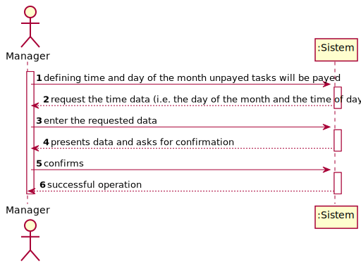
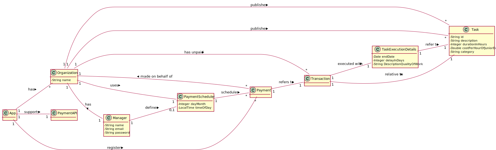
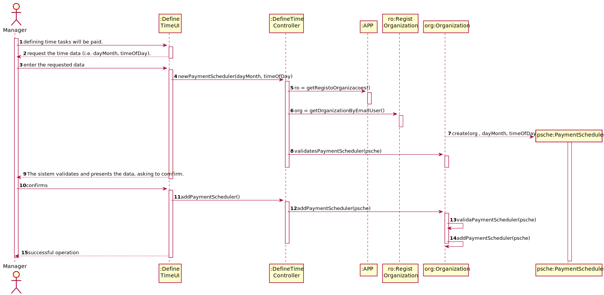
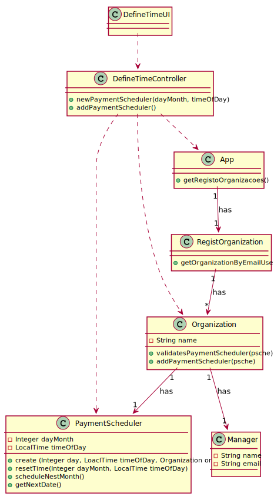

# UC05 - Define Time and Day of the Month Unpayed Tasks Will Be Payed

## 1. Requirements Engineering

### Brief Format

The manager of the organization stars defining time and day of the month unpayed tasks will be payed. The sistem request the time data (i.e. the day of the month and the time of day). The manager of the organization enter the requested data. The sistem validates and presents the data, asking to comfirm. The manager of the organization confirms. The sistem **defines time and day of the month unpayed tasks will be payed** e informs the manager of the organization of the success of the operation.

### SSD

### Complete format

#### Main actor

Manager

#### Intrested Parties and Their Intrests
* **Manager:** pretends defining time and day of the month unpayed tasks will be payed.
* **Organization:** pretends that taks unpayed tasks will be payed.
* **T4J:** pretends tasks can be payed.

#### Preconditions
n/h

#### Postconditions
The registration information is saved in the system.

#### Main success scenario (or basic flow)

1. The manager of the organization stars defining time and day of the month unpayed tasks will be payed.
2. The sistem request the time data (i.e. the day of the month and the time of day).
3. The manager of the organization enter the requested data.
4. The sistem validates and presents the data, asking to comfirm.
5. The manager of the organization confirms.
6. The sistem **defines time and day of the month unpayed tasks will be payed** e informs the manager of the organization of the success of the operation.

#### Extensions (or alternative flows)

*a. the manager requests to cancel the registration.

> Use case ends.

4a. Missing minimum required data.
>	1. The system informs you which data is missing.
>	2. The system allows you to enter the missing data (step 3)
>
	>	2a. the  manager does not change the data. The use case ends.

4b. The system detects that the data (or some subset of the data) entered must be unique and that it already exists in the system.
>	1. The system alerts the  manager to the fact.
>	2. The system allows you to change it (step 3)
>
	>	2a. the  manager does not change the data. The use case ends.

#### Special requirements
\-

#### List of Technologies and Data Variations
\-

#### Frequency of Occurrence
\-

#### Open questions

* Are there any other mandatory data in addition to those already known?
* Is there any additional safety mechanism to make sure the tasks will be paid in time?

## 2. OO Analysis

### Excerpt from the Relevant Domain Model for UC

## 3. Design - Use Case Realization

### Rational

| Main Flow | Question: What Class... | Answer  | Justification  |
|:--------------  |:---------------------- |:----------|:---------------------------- |
|1. The manager of the organization stars defining time tasks will be payed.|... interact with the user?| DefineTimeUI |Pure Fabrication|
| |... coordinate the UC?| DefineTimeController |Controller|
| |... creates PaymentScheduler instances? | Organization | IE: Organization has all the necessary data to process the time the task will be payed.
|2. The sistem request the time data (i.e. the day of the month and the time of day).||||
|3. The manager of the organization enter the requested data. |... save the data entered?| PaymentScheduler |IE: instance created in step 1|
|4. the sistem validates and presents the data, asking to comfirm. |... validates the PaymentScheduler's data (local validation) |PaymentScheduler |IE: has its own data|
| |... validates the PaymentScheduler's data (local validation)| Organization | IE: Orgaanization has registered PaymentScheduler|
|5. The manager of the organization confirms. ||||
|6. The sistem **defines time and day of the month unpayed tasks will be payed** e informs the manager of the organization of the success of the operation.|... saves the added PaymentScheduler?| Organization || IE: By applying HC + LC to the PaymentScheduler |

### Systematization ##

 It follows from the rational that the conceptual classes promoted to software classes are:

 * App
 * Organization
 * Manager
 * PaymentScheduler

Other software classes (i.e. Pure Fabrication) identified:

 * DefineTimeUI
 * DefineTimeController
 * RegistOrganization

###	Sequence Diagram

###	Class Diagram

