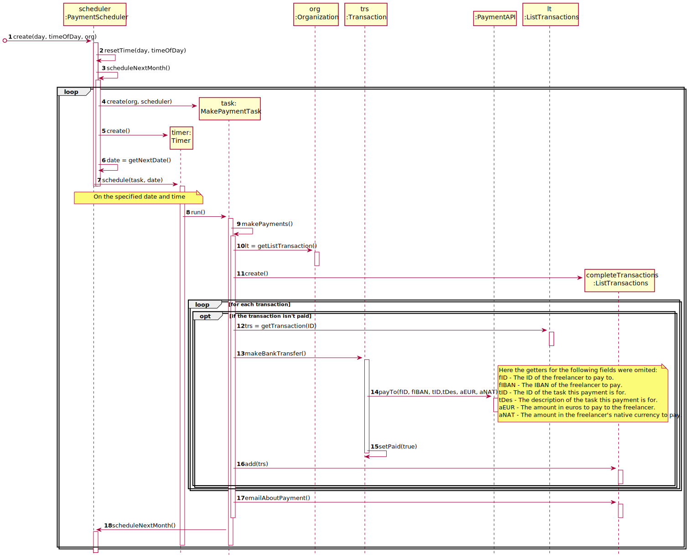

# UC6 - Automatically Make Payments

## 1. Requirements Engineering

### Brief Format

Time starts the process of making payments on unpaid transactions of a certain organization.

### SSD

### Complete Format

#### Main Actor

- Time.

#### Interested Parties and Their Interests
* **Freelancer:** intends to get paid on a timely fashion.
* **Organization:** intends for their payments to be made with the least work possible.
* **T4J:** intends to automate the payment process for companys.

#### Pre-Conditions
The organization's manager has defined a payment schedule.

#### Pos-conditions
All of the organization's unpaid transactions will be paid.
An e-mail will be sent to each freelancer who had an unpaid transaction with the company.

#### Main Scenario of Success (or Basic Flux)

1. Time starts the process of making payments on unpaid transactions of a certain organization.

#### Extensions (or Alternative Fluxes)

1a. The specified date to process the payments does not correspond to the current date.

> The use case ends.

#### Special Requirements
\-

#### List of Variations in Technology or Data

- Timer.

#### Frequency of Occurrence

- Every month after a schedule is set.

#### Open Questions

- Are there any other types of data needed to make the payment?
- Is there any additional safety mechanism to make sure the payments are being safely processed?
- What happens if a bank payment fails to go trough.

## 2. OO Analysis

### Excerpt from the Relevant Domain Model for UC

## 3. Design - Use Case Realization

### Rational

| Main Flow                                                                                     | Question: What Class ...                                       | Answer          | Justification               |
|:--------------                                                                                |:----------------------                                         |:----------      |:----------------------------|
|1. Time starts the process of making payments on unpaid transactions of a certain organization.| … coordinates the UC?                                          | MakePaymentTask | Controller. |
|                                                                                               | … knows the transactions that need to be payed?                | Transaction     | Information expert (IE), Transaction is logically connected with PaymentDetails. |
|                                                                                               | … knows the freelancer to make the payment to?                 | Transaction     | IE: Transaction is connected to Freelancer in the MD. |
|                                                                                               | … is responsible for making payment transactions to the bank?  | Transaction     | IE: Transaction has all the necessary data to process the transaction to the bank. |
|                                                                                               | … stores the information that the transaction has been payed?  | PaymentDetail   | IE: in the MD PaymentDetail contains that information. |

### Systematization

It follows from the rational that the conceptual classes promoted to software classes are:

 * Transaction
 * PaymentDetail

Other software classes (i.e. Pure Fabrication) identified:

 * MakePaymentTask

### Sequence Diagram

*Note: this UC is only concerned with messages 8 trough 24, all other messages are included for context.*

### Class Diagram

