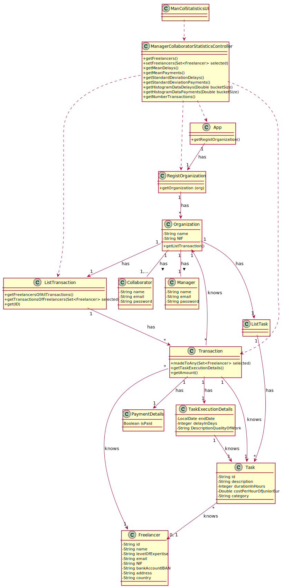

# UC07 - Visualize Overall Statistics About Task Execution Times

## 1. Requirements Engineering

### Brief Format

TThe collaborator or the manager stars the visualize of overall statistics about freelancers. The system shows the freelancers in the system that working in the same oganization of the user and requests the user to select which ones to include. The collaborator or the manager selects more than one freelancer. The sistem presents the information ( mean and the standard deviation of the delays ; histogram to analyze the delays ; mean and the standard deviation of the payments made ).

### SSD

### Complete format

#### Main actor

Collaborator
Manager

#### Intrested Parties and Their Intrests
* **Collaborator:** pretends to see and analyse information about the freelancer's task execution.
* **Manager:** pretends to see and analyse information about the freelancer's task execution.
* **Organization** pretends that information about task execution can be visualize.
* **T4J:** pretends to better the experience of their users by analyzing the way they are using the system.

#### Preconditions
The information of the task execution is alredy saved in the system.

#### Postconditions
n/h

#### Main success scenario (or basic flow)

1. The collaborator or the manager stars the visualize of overall statistics about freelancers.
2. The system shows the freelancers in the system that working in the same oganization of the user and requests the user to select which ones to include.
3. The collaborator or the manager selects more than one freelancer.
4. The sistem presents the information ( mean and the standard deviation of the delays ; histogram to analyze the delays ; mean and the standard deviation of the payments made ).

#### Extensions (or alternative flows)

*1a. The collaborator or the manager requests the cancellation of the process.

> The use case ends.

3a. The sistem detects that no freelancers have been selected.

> The use case allows the collaborator or the manager to make a new selection starting from step 2.

4a. The system detects that the selected freelancers have not completed any tasks.

> The system informs the user of the error and allows the collaborator or the manager to make a new selection starting from step 2.

#### Special requirements
\-

#### List of Technologies and Data Variations
\-

#### Frequency of Occurrence
\-

#### Open questions

* How often does this use case occur?

## 2. OO Analysis

### Excerpt from the Relevant Domain Model for UC

## 3. Design - Use Case Realization

### Rational

|Main Flow  |Question: What Class ... |Answer|Justification|
|:---------|:---------|:---------|:---------|
|1.  The collaborator or the manager stars the visualize of overall statistics about freelancers.|… interacts with the user?|ManColrStatisticsUI|Pure Fabrication.|
||… coordinates the UC?|ManagerCollaboratorStatisticsController|Controller.|
|2. The system shows the freelancers in the system that working in the same oganization of the user and requests the user to select which ones to include.|… knows the freelancers that working in the Organization?|ListTransaction| The ListTransaction knows all freelancer that worked in the Organization|
|3.  The collaborator or the manager selects more than one freelancer.||||
|4. The sistem presents the information ( mean and the standard deviation of the delays ; histogram to analyze the delays ; mean and the standard deviation of the payments made ).|… knows the data about the payment and delay?|Transaction|In the MD transaction contains TaskExecutionDetails.|
||… knows all the transactions made to the freelancers by a certain organization?|ListTransaction|By the IE principle Organization contains Transaction, however by the HC+LC principle, that responsibility has been assigned to ListTransaction.|
||… knows all the transactions made to the freelancers?|RegistOrganization|By the IE principle App contains Organization, however by the HC+LC principle, that responsibility has been assigned to RegistOrganization.|

### Systematization ##

 It follows from the rational that the conceptual classes promoted to software classes are:

 * App
 * Manager
 * Collaborator
 * Organization
 * Transaction
 * Freelancer
 * TaskExecutionDetails
 * Task

Other software classes (i.e. Pure Fabrication) identified:

 * ManColrStatisticsUI
 * ManagerCollaboratorStatisticsController
 * RegistOrganization
 * ListTransaction

###	Sequence Diagram

###	Class Diagram

