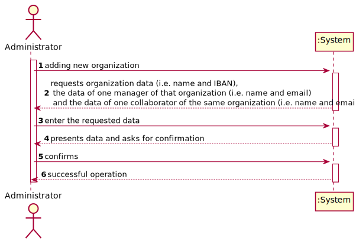
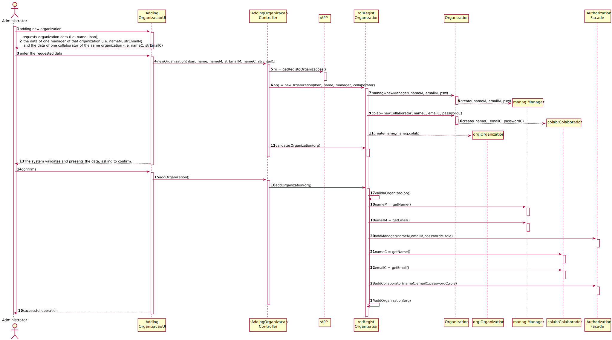

# UC08 - Add New Organization

## 1. Requirements Engineering

### Brief Format

The Administrator stars the adding of a new organization. The system request the organization data (i.e. name and IBAN) ,the data of one manager of that organization (i.e. name and email) and  the data of one collaborator of the same organization  (i.e. name and email). The Administrator enter the requested data. The system validates and presents the data, asking to confirm. The Administrator confirms. The system **adds the new organization information and the information about one manager and collaborator** e informs the administrator of the success of the operation.

### SSD

### Complete format

#### Main actor

Administrator

#### Interested Parties and Their Interests
* **Administrator:** pretends to add new organizations so that it can take advantage of the functionality provided by the platform.
* **T4J:** pretends that new organization can be added in order to use the platform.

#### Pre-Conditions
\-

#### Pos-Conditions
The registration information is saved in the system.

#### Main success scenario (or basic flow)

1. The Administrator stars the adding of a new organization.
2. The system request the organization data (i.e. name and IBAN) ,one manager of that organization (i.e. name and email) and one collaborator of the same organization  (i.e. name and email).
3. The Administrator enter the requested data.
4. The system validates and presents the data, asking to confirm.
5. The Administrator confirms.
6. The system **adds the new organization information and the information about one manager and collaborator** and informs the administrator of the success of the operation.

#### Extensions (or alternative flows)

*a. the administrator requests to cancel the registration.

> Use case ends.

4a. Missing minimum required data.
>	1. The system informs you which data is missing.
>	2. The system allows you to enter the missing data (step 3)
>
	>	2a. the administrator does not change the data. The use case ends.

4b. The system detects that the data (or some subset of the data) entered must be unique and that it already exists in the system.
>	1. The system alerts the administrator to the fact.
>	2. The system allows you to change it (step 3)
>
	>	2a. the administrator does not change the data. The use case ends.

#### Special requirements
\-

#### List of Technologies and Data Variations
\-

#### Frequency of Occurrence
\-

#### Open questions

* Are there any other mandatory data in addition to those already known?
* What data together can detect the duplication of organizations (and managers)?
* Is there an additional security mechanism necessary to confirm that the organization exists and is represented by the person who registered it?
* What are the security rules applicable to the password?
* How often does this use case occur?

## 2. OO Analysis

### Excerpt from the Relevant Domain Model for UC

## 3. Design - Use Case Realization

### Rational

| Main Flow | Question: What Class... | Answer  | Justification  |
|:--------------  |:---------------------- |:----------|:---------------------------- |
|1. the administrator stars the adding of a new organization.|... interact with the user?| CreateOrganizationUI |Pure Fabrication|
| |... coordinate the UC?| CreateOrganizationController |Controller|
| | ... creates Organization instances? | RegistOrganization | By applying the Creator (R1) it would be the “App".But, by applying HC + LC to the “Platform", this delegates that responsibility to the “RegistOrganization".
|2. the system request the organization data (i.e. name and IBAN) ,one manager of that organization (i.e. name and email) and one collaborator of the same organization  (i.e. name and email).||||
|3. the administrator enter the requested data. |... save the data entered?|Organization, Manager, Collaborator|IE: instance created in step 1|
| |... create instances of Manager?|Organization|creator(rule1)|
| |... create instances of Collaborator?|Organization|creator(rule1)|
|4. the system validates and presents the data, asking to confirm. |... validates the Organization's data (local validation) |Organization |IE: has its own data|
| |... validates the Organization's data (local validation)| Manager |IE: has its own data|
| |... validates the Organization's data (local validation)| Collaborator | IE: has its own data|
| |... validates the Organization's data (local validation)| RegistOrganization | IE: RegistOrganization has registered Organizations|
|5. The Administrator confirms. ||||
|6. The system **adds the new organization information and the information about one manager and collaborator** and informs the administrator of the success of the operation.|... saves the added Organization?| RegistOrganization || IE: By applying HC + LC to the App |
| |... register / keep the User's regarding the Organization's collaborator and manager?|AuthorizationFacade|IE. User management is the responsibility of the respective external component whose point of interaction is through the class "AuthorizationFacade"|

### Systematization ##

 It follows from the rational that the conceptual classes promoted to software classes are:

 * App
 * Administrator
 * Organization
 * Collaborator
 * Manager

Other software classes (i.e. Pure Fabrication) identified:

 * CreateOrganizationUI
 * CreateOrganizationController
 * RegistOrganization

###	Sequence Diagram

###	Class Diagram

