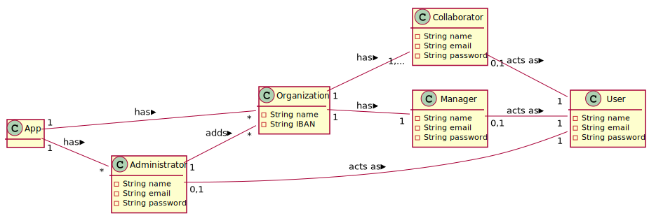

# UC08 - Add New Organization

## 1. Requirements Engineering

### Brief Format

The Administrator stars the adding of a new organiztion. The sistem request the organization data (i.e. name) ,the data of one manager of that organization (i.e. name, email and password) and  the data of one colaborator of the same organization  (i.e. name, email and password). The Administrator enter the requested data. The sistem validates and presents the data, asking to comfirm. The Administrator confirms. The sistem **adds the new organization information and the information about one manager and colaborator** e informs the admintrator of the success of the operation.

### SSD

### Complete format

#### Main actor

Administrator

#### Partes interessadas e seus interesses
* **Administrator:** pretends to add new organizations so that it can take advantage of the functionality provided by the platform.
* **T4J:** pretends that new organization can be added in order to use the platform.

#### Preconditions
n/h

#### Postconditions
The registration information is saved in the system.

#### Main success scenario (or basic flow)

1. The Administrator stars the adding of a new organiztion.
2. The sistem request the organization data (i.e. name) ,one manager of that organization (i.e. name, email and password) and one colaborator of the same organization  (i.e. name, email and password).
3. The Administrator enter the requested data.
4. The sistem validates and presents the data, asking to comfirm.
5. The Administrator confirms.
6. The sistem **adds the new organization information and the information about one manager and colaborator** e informs the admintrator of the success of the operation.

#### Extensions (or alternative flows)

*a. the administrator requests to cancel the registration.

> Use case ends.

4a. Missing minimum required data.
>	1. The system informs you which data is missing.
>	2. The system allows you to enter the missing data (step 3)
>
	>	2a. the administrator does not change the data. The use case ends.

4b. The system detects that the data (or some subset of the data) entered must be unique and that it already exists in the system.
>	1. The system alerts the administrator to the fact.
>	2. The system allows you to change it (step 3)
>
	>	2a. the administrator does not change the data. The use case ends.

#### Special requirements
\-

#### List of Technologies and Data Variations
\-

#### Frequency of Occurrence
\-

#### Open questions

* Are there any other mandatory data in addition to those already known?
* What data together can detect the duplication of organizations (and managers)?
* Is there an additional security mechanism necessary to confirm that the organization exists and is represented by the person who registered it?
* What are the security rules applicable to the password?
* How often does this use case occur?

## 2. OO Analysis

### Excerpt from the Relevant Domain Model for UC

## 3. Design - Use Case Realization

### Rational

| Fluxo Principal | Questão: Que Classe... | Resposta  | Justificação  |
|:--------------  |:---------------------- |:----------|:---------------------------- |
|1. O utilizador não registado inicia o registo de uma organização.|... interage com o utilizador?| RegistarOrganizacaoUI |Pure Fabrication|
| |... coordena o UC?| RegistarOrganizacaoController |Controller|
| |... cria instâncias de Organizacao?|Plataforma|Creator(regra1)|
|2. O sistema solicita os dados necessários sobre a organização (i.e. nome da organização, o NIF, o endereço postal, um contacto telefónico, o endereço web, email) e sobre o colaborador (i.e. gestor) que está a proceder ao registo (i.e. nome, função, contacto telefónico, email e pwd).||||
|3. O utilizador não registado introduz os dados solicitados. |... guarda os dados introduzidos?|Organizacao, EnderecoPostal, Colaborador|IE: instância criada no passo 1|
| |... cria instâncias de EnderecoPostal?|Organizacao|creator(regra1)|
| |... cria instâncias de Colaborador?|Organizacao|creator(regra1)|
|4. O sistema valida e apresenta os dados, pedindo que os confirme. |... valida os dados da Organizacao (validação local)|Organizacao|IE: possui os seus próprios dados|
| |... valida os dados da Organizacao (validação local)|EnderecoPostal|IE: possui os seus próprios dados|
| |... valida os dados da Organizacao (validação local)|Colaborador|IE: possui os seus próprios dados|
| |... valida os dados da Organizacao (validação global)|Plataforma|IE: A Plataforma tem registadas Organizacao|
|5. O utilizador não registado confirma. ||||
|6. O sistema **regista os dados da organização e  do seu colaborador/gestor, tornando este último um utilizador registado** e informa o utilizador não registado do sucesso da operação.|... guarda a Organizacao criada?| Plataforma |IE: No MD a Plataforma tem  Organizacao|
| |... regista/guarda o Utilizador referente ao Colaborador da Organizacao?|AutorizacaoFacade|IE. A gestão de utilizadores é responsabilidade do componente externo respetivo cujo ponto de interação é através da classe "AutorizacaoFacade"|

### Sistematização ##

 Do racional resulta que as classes conceptuais promovidas a classes de software são:

 * Plataforma
 * Organizacao
 * Colaborador
 * EnderecoPostal

Outras classes de software (i.e. Pure Fabrication) identificadas:  

 * RegistarOrganizacaoUI  
 * RegistarOrganizacaoController

###	Diagrama de Sequência

###	Diagrama de Classes

