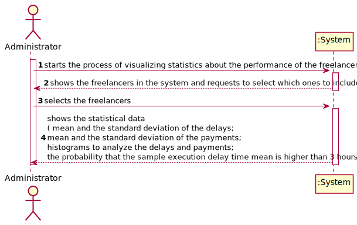
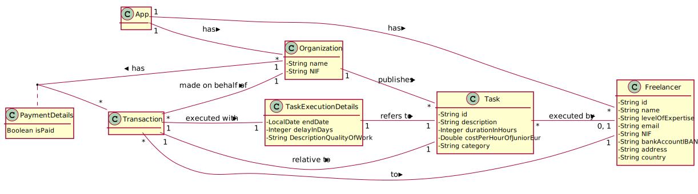
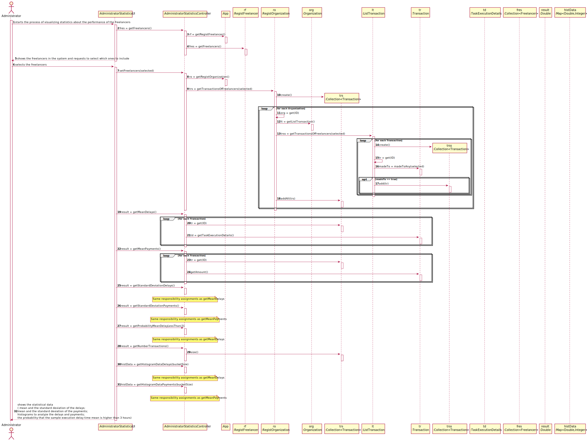
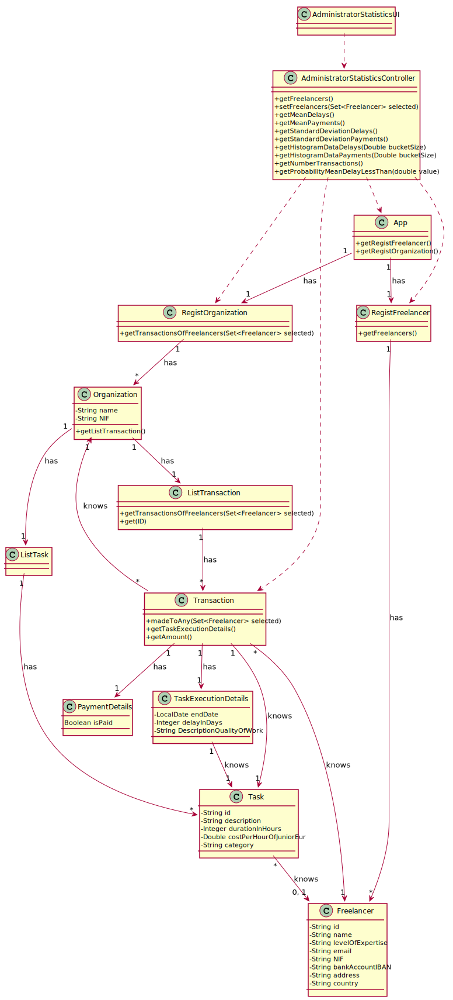

# UC9 - Administrator Statistics Visualization

## 1. Requirements Engineering

### Brief Format

The administrator starts the process of visualizing statistics about the performance of the freelancers. The system shows the freelancers in the system and requests the user to select which ones to include. The administrator selects the freelancers. The systems shows the statistical data ( mean and the standard deviation of the delays; mean and the standard deviation of the payments; histograms to analyze the delays and payments; the probability that the sample execution delay time mean is higher than 3 hours ).

*Note: The probability that the sample execution delay time mean is higher than 3 hours is calculated considering that the task delay is normally distributed with a mean of 2 hours and a standard deviation of 1.5 hours.*

### SSD

### Complete Format

#### Main Actor

- Administrator.

#### Interested Parties and Their Interests
* **Administrator:** intends to be able to analyze data about the transactions in their system.
* **T4J:** intends to better the experience of their users by analyzing the way they are using the system.

#### Pre-Conditions
\-

#### Pos-Conditions
\-

#### Main Scenario of Success (or Basic flow)

1. The administrator starts the process of visualizing statistics about the performance of the freelancers.
2. The system shows the freelancers in the system and requests the user to select which ones to include.
3. The administrator selects more than one freelancer.
4. The systems shows the statistical data ( mean and the standard deviation of the delays; mean and the standard deviation of the payments; histograms to analyze the delays and payments; the probability that the sample execution delay time mean is higher than 3 hours ).

#### Extensions (or Alternative Flows)

1*a. The user requests the cancellation of the process.

> The use case ends.

3a. The freelancer detects that no freelancers have been selected.

> The use case allows the administrator to make a new selection starting from step 2.

4a. The system detects that the selected freelancers have not completed any tasks.

> The system informs the user of the error and allows the administrator to make a new selection starting from step 2.

#### Special Requirements
\-

#### List of Variations in Technology or Data
\-

#### Frequency of Occurrence
\-

#### Open Questions

- What is the frequency of occurrence of this UC?

## 2. OO Analysis

### Excerpt from the Relevant Domain Model for UC

## 3. Design - Use Case Realization

### Rational
|Main Flow  |Question: What Class ... |Answer|Justification|
|:---------|:---------|:---------|:---------|
|1. The administrator starts the process of visualizing statistics about the performance of the freelancers.|… interacts with the user?|AdministratorStatisticsUI|Pure Fabrication.|
||… coordinates the UC?|AdministratorStatisticsController|Controller.|
|2. The system shows the freelancers in the system and requests the user to select which ones to include.|… knows the freelancers that exist in the system?|RegistFreelancer|By the Information Expert (IE) principle App contains Freelancer, however by the High Cohesion & Low Coupling (HC+LC) principle, that responsibility has been assigned to RegistFreelancer.|
|3. The administrator selects more than one freelancer.||||
|4. The systems shows the statistical data ( mean and the standard deviation of the delays; mean and the standard deviation of the payments; histograms to analyze the delays and payments; the probability that the sample execution delay time mean is higher than 3 hours ).|… knows the data about the payment and delay?|Transaction|In the MD transaction contains TaskExecutionDetails.|
||… knows all the transactions made to the freelancers by a certain organization?|ListTransaction|By the IE principle Organization contains Transaction, however by the HC+LC principle, that responsibility has been assigned to ListTransaction.|
||… knows all the transactions made to the freelancers?|RegistOrganization|By the IE principle App contains Organization, however by the HC+LC principle, that responsibility has been assigned to RegistOrganization.|

### Systematization

It follows from the rational that the conceptual classes promoted to software classes are:

 * Transaction

Other software classes (i.e. Pure Fabrication) identified:

 * AdministratorStatisticsUI
 * AdministratorStatisticsController
 * RegistFreelancer
 * ListTransaction
 * RegistOrganization

### Sequence Diagram

### Class Diagram

