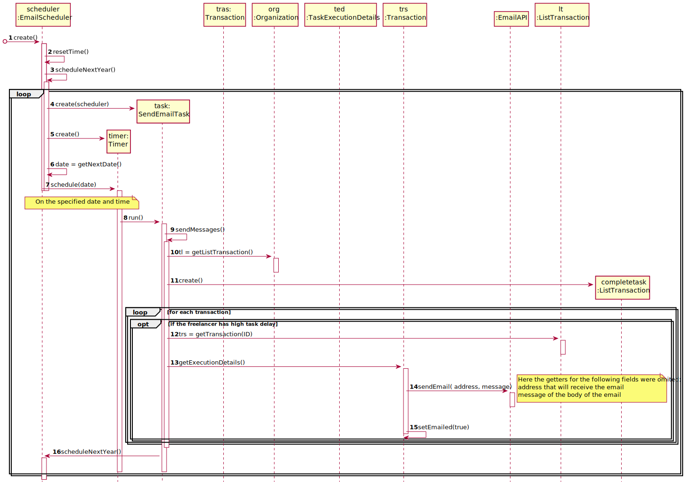

# UC10 - Send E-mail to Late Freelancers

## 1. Requirements Engineering

### Brief Format

Time starts the process of sending emails to all freelancers who have high task delay.

### SSD

### Complete format

#### Main actor

Timer

#### Partes interessadas e seus interesses
* **Organization:** pretends to inform freelancer that have more task delay than the mean.
* **T4J:** intends to automate process email freelancers that have high task delay.

#### Preconditions
n/h

#### Postconditions
An e-mail will be sent to each freelancer who had high task delay.

#### Main success scenario (or basic flow)

1. Time starts the process of sending email´s to all freelancers who have high task delay.

#### Extensions (or alternative flows)

a. The specified date to process of sending email´s does not correspond to the current date.

> The use case ends.

#### Special requirements
\-

#### List of Technologies and Data Variations
- Timer.

#### Frequency of Occurrence
- Every month after a schedule is set.

#### Open questions

* Are there any other mandatory data in addition to those already known?
- What happens if the sending of the email fails to go trough.

## 2. OO Analysis

### Excerpt from the Relevant Domain Model for UC

## 3. Design - Use Case Realization

### Rational

| Main Flow | Question: What Class... | Answer  | Justification  |
|:--------------  |:---------------------- |:----------|:---------------------------- |
|1. Time starts the process of sending email´s to all freelancers.| … coordinates the UC?       | Delaycontroller | Controller. |
|                                                                                               | … knows the task is delayed?                | TaskExecutionDetails     | Information expert (IE), TaskExecutionDetails is logically connected with Task. |
|                                                                                               | … knows the freelancer to email to?        | TaskExecutionDetails     | IE: TaskExecutionDetails is connected to Freelancer in the MD. |
|                                                                                               | … is responsible to email?  | EmailAPI     | IE: EmailAPI has all the necessary data to process the email freelancer. |
|                                                                                               | … stores the information that the email has been send ?  | EmailScheduler   | IE: in the MD EmailScheduler contains all email sending information. |

### Systematization ##

 It follows from the rational that the conceptual classes promoted to software classes are:

 * App
 * Organization
 * EmailScheduler
 * Task
 * TaskExecutionDetails
 * Freelancer

Other software classes (i.e. Pure Fabrication) identified:

 * DelayController
 * TaskList

###	Sequence Diagram

###	Class Diagram

