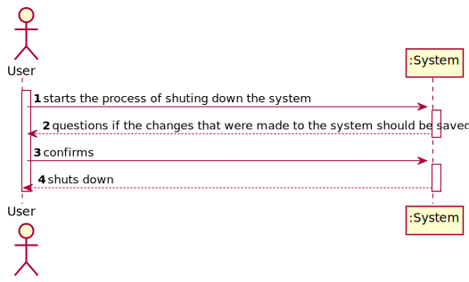
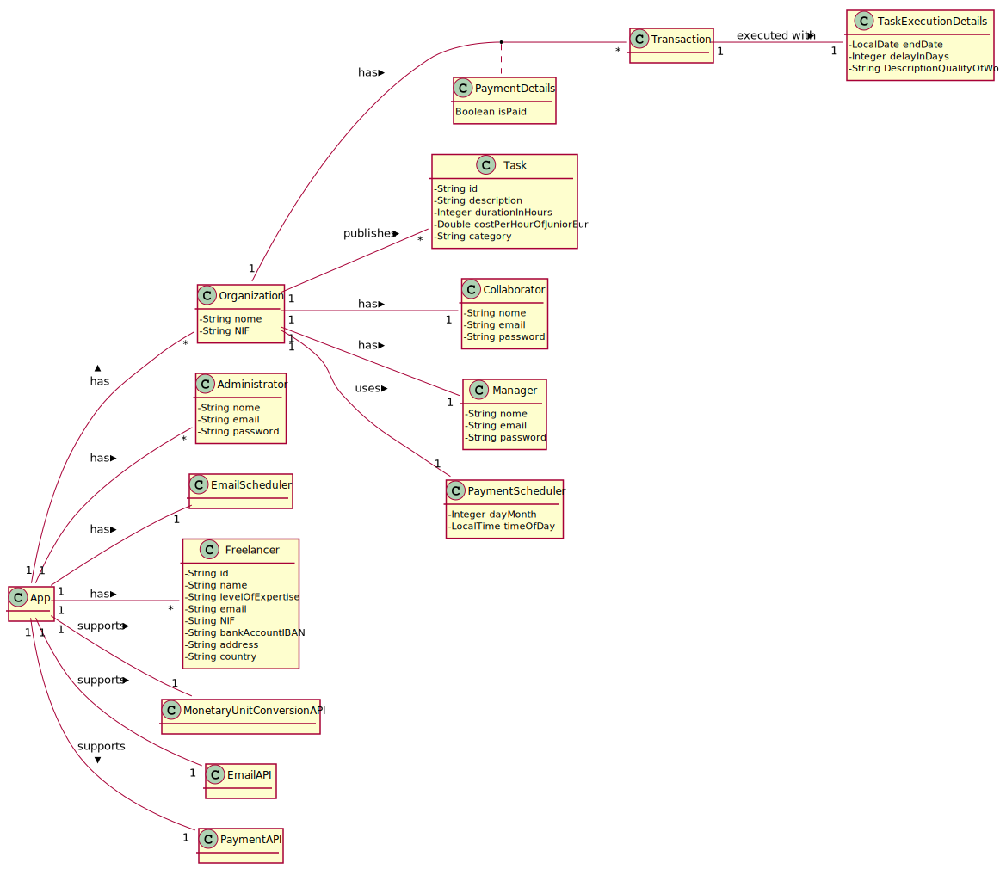
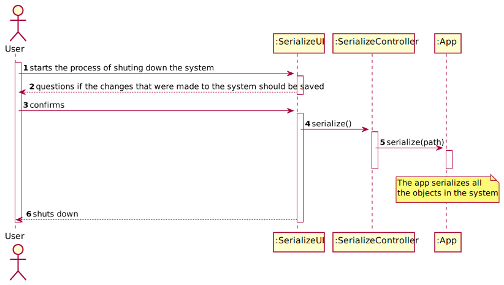
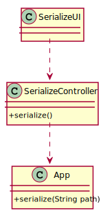

# UC11 - Serialize Information To File

## 1. Requirements Engineering

### Brief Format

The user starts the process of shuting down the system. The system questions if the changes that were made to the system should be saved. The user confirms. The system saves all the data to a file and shuts down.

### SSD

### Complete Format

#### Main Actor

- User.

#### Interested Parties and Their Interests
* **Administrator:** intends to be able to save the data they inserted/ changed in the system.
* **T4J:** intends to allow the app to maintain it's state between multiple runs.

#### Pre-Conditions
\-

#### Pos-conditions
\-

#### Main Scenario of Success (or Basic Flux)

1. The user starts the process of shuting down the system.
2. The system questions if the changes that were made to the system should be saved.
3. The user confirms.
4. The system saves all the objects to a file in the hard drive.
5. The system shuts down.

#### Extensions (or Alternative Fluxes)

*a. The user requests the cancellation of the process.

> The use case ends.

4a. An error occurs while trying to save the data.

> 1. The system informs the user of the error.
> 2. The use case ends.

#### Special Requirements
\-

#### List of Variations in Technology or Data
\-

#### Frequency of Occurrence
\-

#### Open Questions

- What is the frequency of occurrence of this UC?

## 2. OO Analysis

### Excerpt from the Relevant Domain Model for UC

## 3. Design - Use Case Realization

### Rational
|Main Flow  |Question: What Class ... |Answer|Justification|
|:---------|:---------|:---------|:---------|
|1. The user starts the process of shuting down the system.                           | ... interacts with the user?                                    | SerializeUI           | PureFabrication.                                                      |
|                                                                                     | ... coordinates the use case?                                   | SerializeController   | Controller.                                                           |
|2. The system questions if the changes that were made to the system should be saved. |                                                                 |                       |                                                                       |
|3. The user confirms.                                                                |                                                                 |                       |                                                                       |
|4. The system saves all the objects to a file in the hard drive.                     | ... is responsible for serializing the data in the system?      | App                   | Information Expert: On the MD App knows all the data in the system.   |
|5. The system shuts down.                                                            |                                                                 |                       |                                                                       |

### Systematization

It follows from the rational that the conceptual classes promoted to software classes are:

 * App

Other software classes (i.e. Pure Fabrication) identified:

 * SerializeUI
 * SerializeController

### Sequence Diagram

### Class Diagram

*NOTE: Some classes were omitted for the sake of brevity.*
