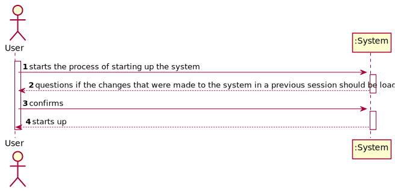
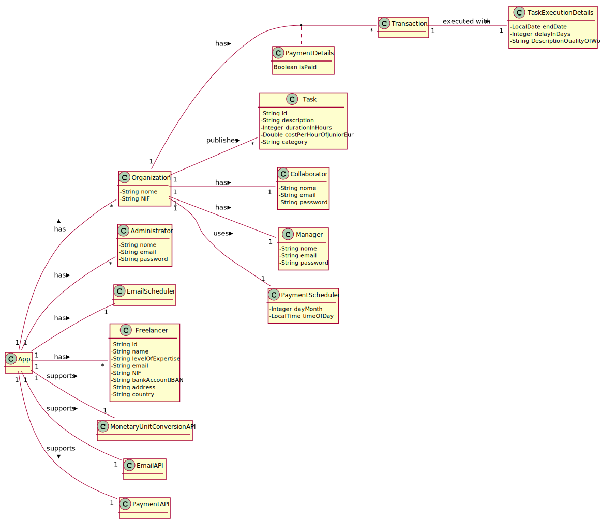
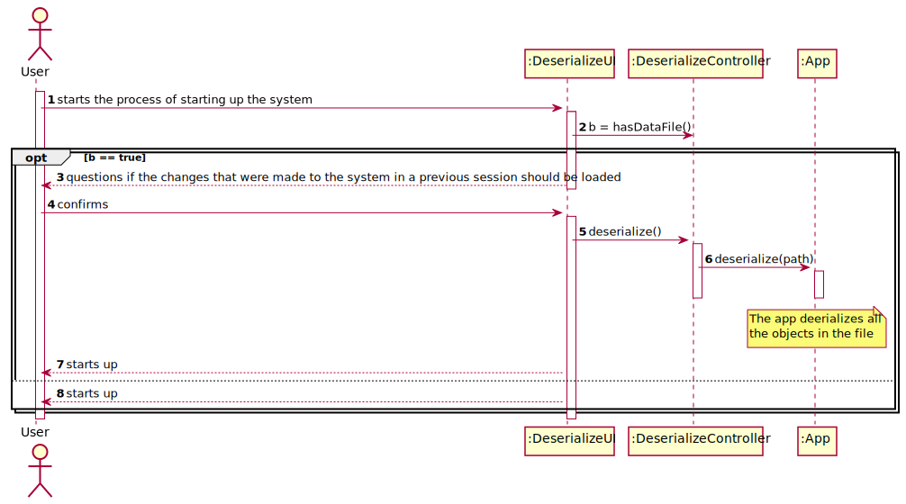
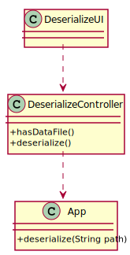

# UC12 - Deserialize Information To File

## 1. Requirements Engineering

### Brief Format

The user starts the process of starting up the system. The system questions if the changes that were made to the system in a previous session should be loaded. The user confirms. The system loads all the data to a file and starts up.

### SSD

### Complete Format

#### Main Actor

- User.

#### Interested Parties and Their Interests
* **Administrator:** intends to be able to loaded the data they inserted/ changed in the system in a previous session.
* **T4J:** intends to allow the app to maintain it's state between multiple runs.

#### Pre-Conditions

A file with data from a previous session must exist on disk.

#### Pos-Conditions
\-

#### Main Scenario of Success (or Basic flow)

1. The user starts the process of starting up the system.
2. The system questions if the changes that were made to the system in a previous session should be loaded.
3. The user confirms.
4. The system loads all the objects from a file in the hard drive to working memory.
5. The system starts up.

#### Extensions (or Alternative Flows)

*a. The user requests the cancellation of the process.

> 1. The use case ends.
> 2. The system does not start up.

3a. The user requests that no data is loaded from file

> 1. The system starts up without loading the data from the file.

4a. An error occurs while trying to load the data.

> 1. The system informs the user of the error.
> 2. The UC ends.
> 3. The system does not start up.

#### Special Requirements
\-

#### List of Variations in Technology or Data
\-

#### Frequency of Occurrence
\-

#### Open Questions

- What is the frequency of occurrence of this UC?

## 2. OO Analysis

### Excerpt from the Relevant Domain Model for UC

## 3. Design - Use Case Realization

### Rational

|Main Flow  |Question: What Class ... |Answer|Justification|
|:---------|:---------|:---------|:---------|
|1. The user starts the process of starting up the system.                                                      | ... interacts with the user?                                                  | DeserializeUI         | PureFabrication.                                                                 |
|                                                                                                               | ... coordinates the use case?                                                 | DeserializeController | Controller.                                                                      |
|2. The system questions if the changes that were made to the system in a previous session should be loaded.    |                                                                               |                       |                                                                                  |
|3. The user confirms.                                                                                          |                                                                               |                       |                                                                                  |
|4. The system loads all the objects from a file in the hard drive to working memory.                           | ... is responsible for deserializing the data in the system and storing it?   | App                   | Information Expert: On the MD App knows and stores all the data in the system.   |
|5. The system starts up.                                                                                       |                                                                               |                       |                                                                                  |

### Systematization

It follows from the rational that the conceptual classes promoted to software classes are:

 * App

Other software classes (i.e. Pure Fabrication) identified:

 * DeserializeUI
 * DeserializeController

### Sequence Diagram

### Class Diagram

*NOTE: Some classes were omitted for the sake of brevity.*
