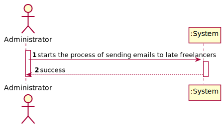
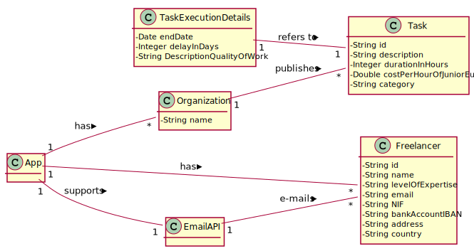
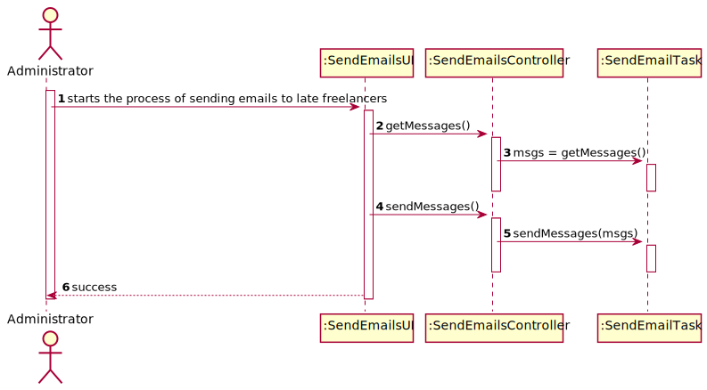
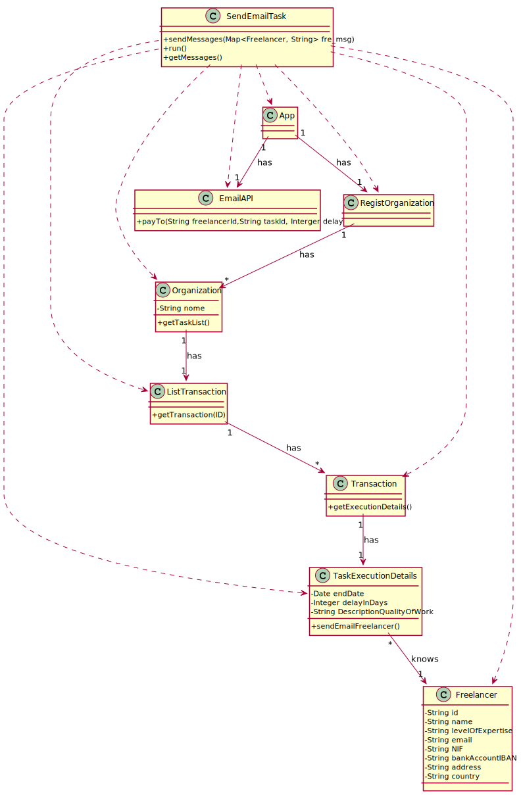

# UC13 - Manually Send E-mail to Late Freelancers

## 1. Requirements Engineering

### Brief Format

The administrator starts the process of sending emails to late freelancers. The system sends the e-mails and informs the administrator of the success of the operation.

### SSD

### Complete Format

#### Main Actor

- Administrator.

#### Interested Parties and Their Interests
* **Administrator:** intends to be able to send e-mails to freelancers at any time.
* **T4J:** intends to satisfy the interests of the administrator.

#### Pre-Conditions

\-

#### Pos-conditions
\-

#### Main Scenario of Success (or Basic Flux)

1. The administrator starts the process of sending emails to late freelancers.
2. The system sends the e-mails and informs the administrator of the success of the operation.

#### Extensions (or Alternative Fluxes)
\-

#### Special Requirements
\-

#### List of Variations in Technology or Data
\-

#### Frequency of Occurrence
\-

#### Open Questions

- What is the frequency of occurrence of this UC?

## 2. OO Analysis

### Excerpt from the Relevant Domain Model for UC

## 3. Design - Use Case Realization

### Rational

|Main Flow  |Question: What Class ... |Answer|Justification|
|:---------|:---------|:---------|:---------|
|1. The administrator starts the process of sending emails to late freelancers.                 | ... interacts with the user?               | SendEmailsUI         | PureFabrication.                                  |
|                                                                                               | ... coordinates the use case?              | SendEmailsController | Controller.                                       |
|2. The system sends the e-mails and informs the administrator of the success of the operation. | ... is responsible for sending the emails? | SendEmailTask        | Task especially created for this purpose in UC10. |

### Systematization

It follows from the rational that the conceptual classes promoted to software classes are:

Other software classes (i.e. Pure Fabrication) identified:

 * SendEmailsUI
 * SendEmailsController
 * SendEmailTask

### Sequence Diagram

### Class Diagram

